# Confidence-Aware Curriculum Knowledge Distillation for TinyML Vision

## Overview

This project presents a unified framework for deploying high-accuracy deep learning models on resource-constrained TinyML devices using a novel Confidence-Aware Curriculum Knowledge Distillation (CL-KD) framework.

The proposed approach integrates:

- Hardware-aware student model optimization
- Confidence-aware curriculum learning
- Monte Carlo dropout-based uncertainty estimation
- Dynamic sample-wise knowledge distillation

The framework is designed for hydrophobicity classification of composite insulators while maintaining strict TinyML deployment constraints.

---

## Key Features

- TinyML-compatible lightweight student models
- Pareto-optimal architecture selection
- Confidence-aware curriculum learning
- Dynamic wisdom ratio for adaptive distillation
- Monte Carlo dropout uncertainty estimation
- Improved performance for ultra-small models
- Hardware-aware optimization under Flash/SRAM constraints

---

# Proposed Framework

## Overall Pipeline

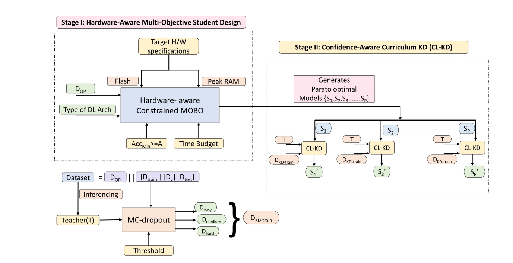

The proposed method consists of two major stages:

### Stage I: Hardware-Aware Student Design

- Multi-objective optimization
- Pareto-optimal model selection
- Flash and SRAM constraint satisfaction
- TinyML deployment feasibility

### Stage II: Confidence-Aware Curriculum Knowledge Distillation (CL-KD)

- Teacher uncertainty estimation
- Confidence-based curriculum partitioning
- Dynamic knowledge distillation
- Sample-wise adaptive learning

---

# Dataset

The experiments are conducted on a hydrophobicity classification dataset collected using the IEC 62073 spray method.

The dataset contains seven hydrophobicity classes:

- HC1
- HC2
- HC3
- HC4
- HC5
- HC6
- HC7

## Dataset Samples

.png)

---

# Teacher and Student Models

## Teacher Models

- Custom CNN
- ResNet50
- MobileNetV3-Large

## Student Models

- Lightweight CNN architectures
- Pareto-optimal TinyML models
- Memory-efficient deployment models

---

# Methodology

## Monte Carlo Dropout-Based Confidence Estimation

Teacher uncertainty is estimated using multiple stochastic forward passes.

### Confidence Estimation

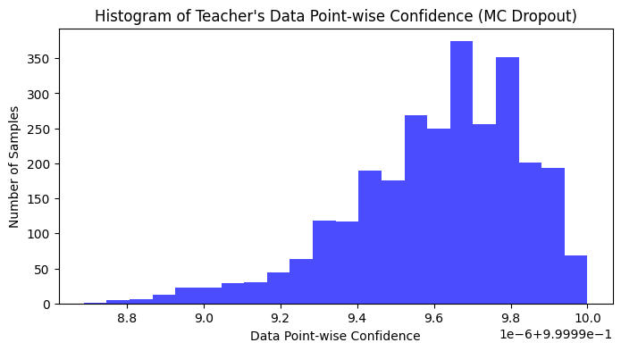

---

## Curriculum Learning Strategy

The dataset is divided into:

- Easy samples
- Medium samples
- Hard samples

Training progression:

```text
Easy → Medium → Hard
```

### Curriculum Learning

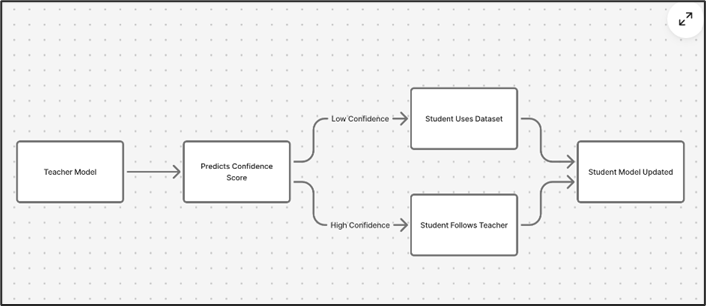

---

## Dynamic Wisdom Ratio

The proposed dynamic wisdom ratio adapts distillation strength according to:

- Student model capacity
- Teacher confidence
- Sample difficulty

### Dynamic KD

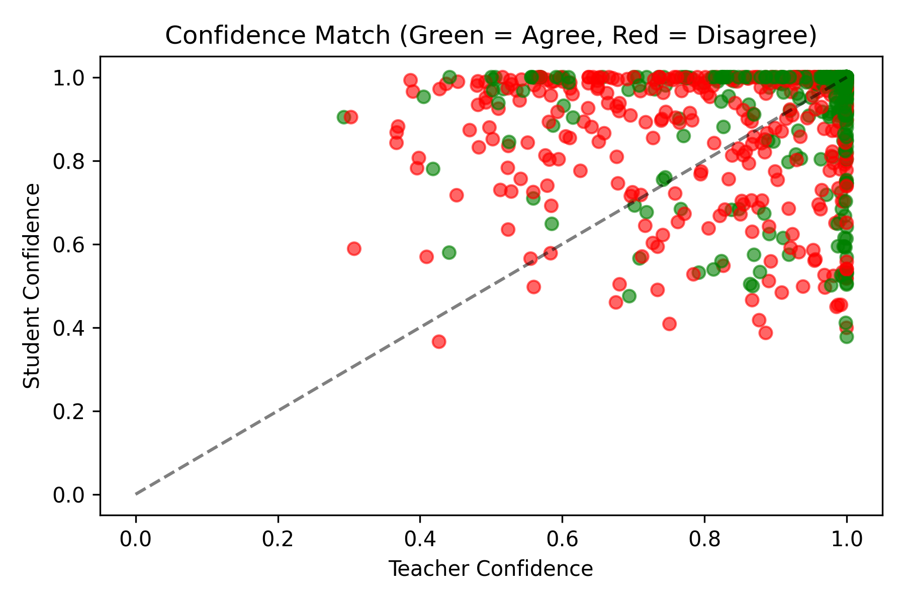

---

# Experimental Setup

## Hardware Configuration

- GPU: NVIDIA RTX 3050
- CPU: Intel i5 12th Gen
- Framework: TensorFlow / Keras

## Training Settings

| Parameter | Value |
|---|---|
| Optimizer | Adam |
| Learning Rate | 1e-3 |
| Batch Size | 64 |
| Temperature (T) | 4 |
| MC Passes | 50 |

---

# Results

## Performance Comparison

| Model | Baseline | Standard KD | CL-KD |
|---|---|---|---|
| Small 1 | 69.00 | 78.00 | 89.14 |
| Small 2 | 76.14 | 70.29 | 86.14 |
| Small 3 | 78.86 | 70.29 | 84.00 |
| Medium 1 | 83.29 | 85.43 | 95.57 |
| Large | 88.29 | 91.57 | 94.67 |

---

## Accuracy vs Model Size

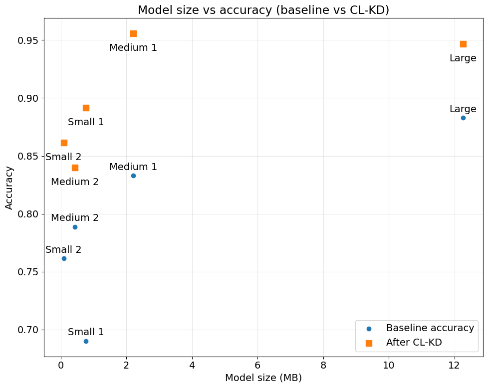

### Key Observations

- CL-KD consistently outperforms standard KD
- Significant improvement for ultra-small models
- Better generalization under TinyML constraints
- Improved Pareto frontier

---

# Dataset Analysis

## t-SNE Visualization

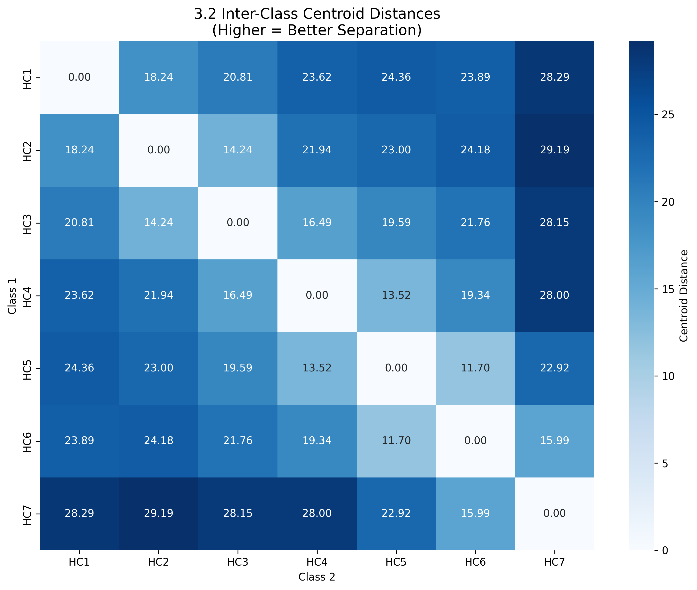

## Fisher Discriminant Ratio

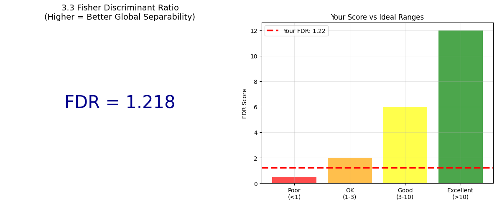

---

# GUI-Based Failure Analysis

## Case 1: Teacher Wrong, Student Correct

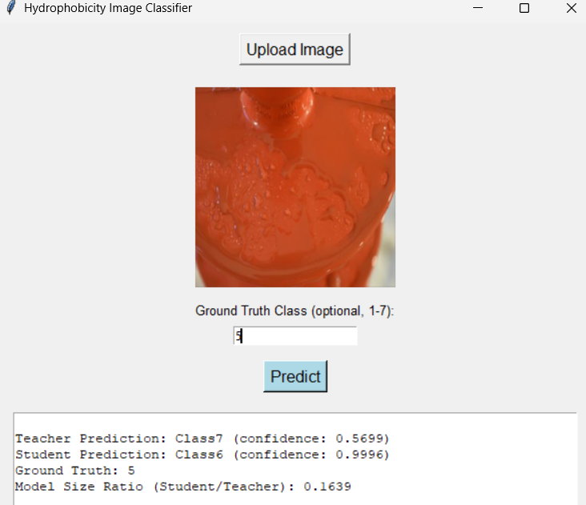

## Case 2: Both Wrong but Student Closer

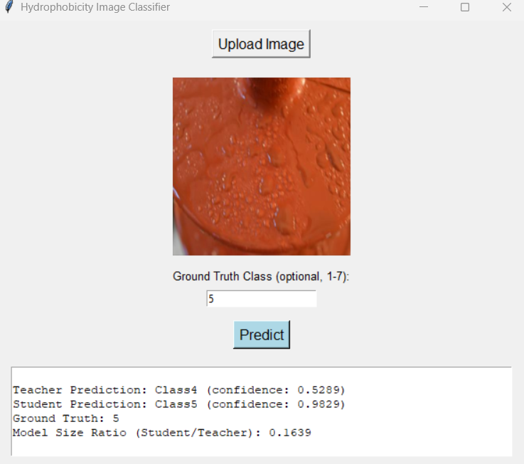

---

# Additional Analysis

## Agreement Rate per Class

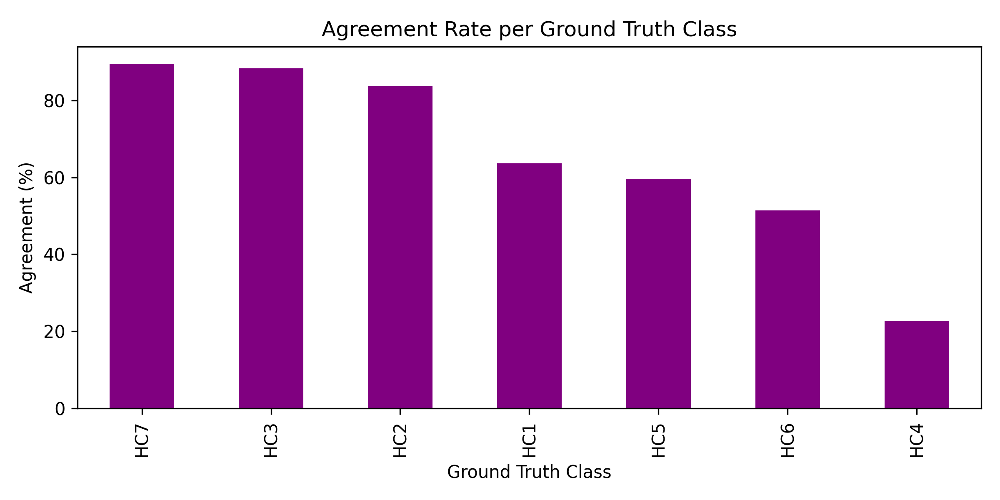

---

## Disagreement Analysis

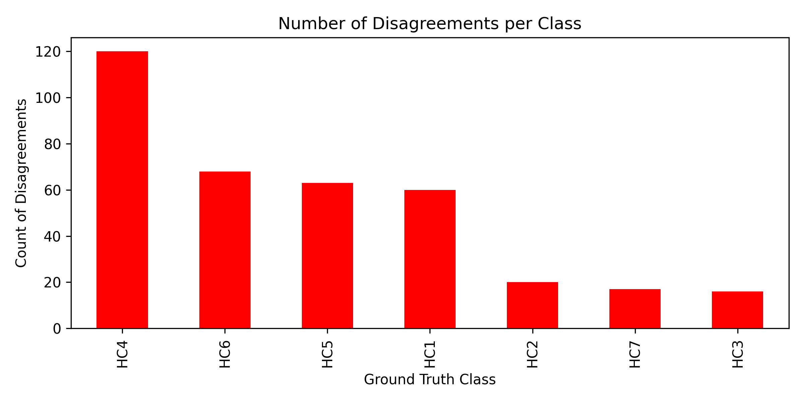

---

## Student Confidence Distribution

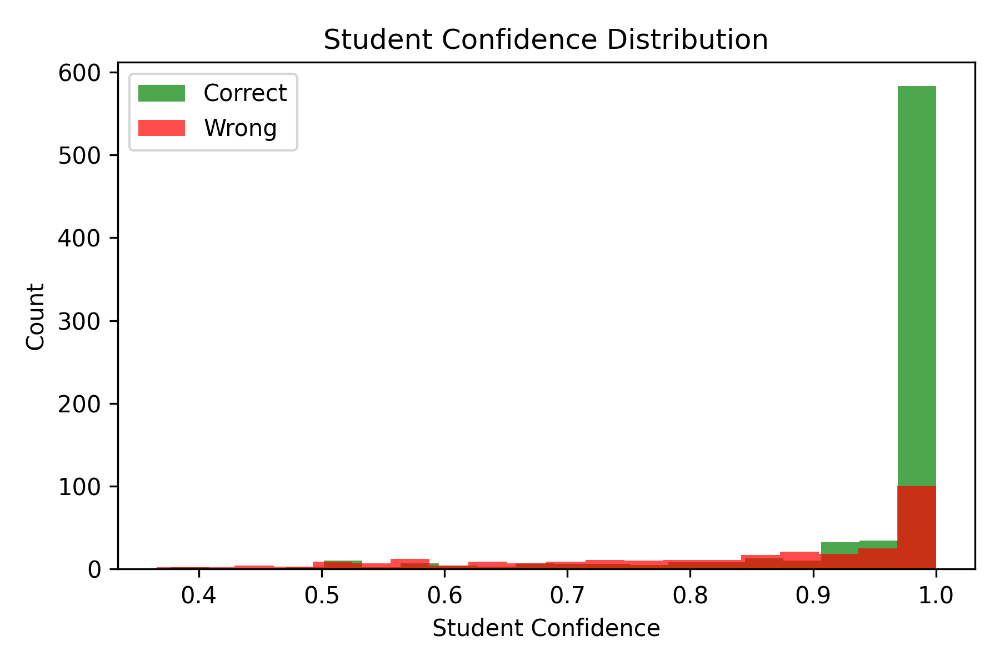

---

## Teacher-Student Confidence Match


---

## Hyperparameter Sensitivity

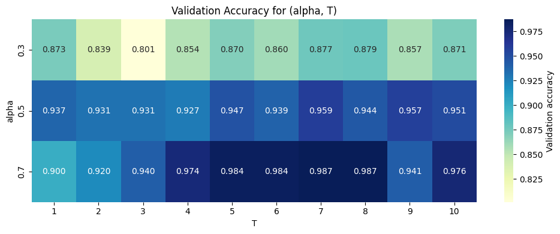

---

## Pareto Front

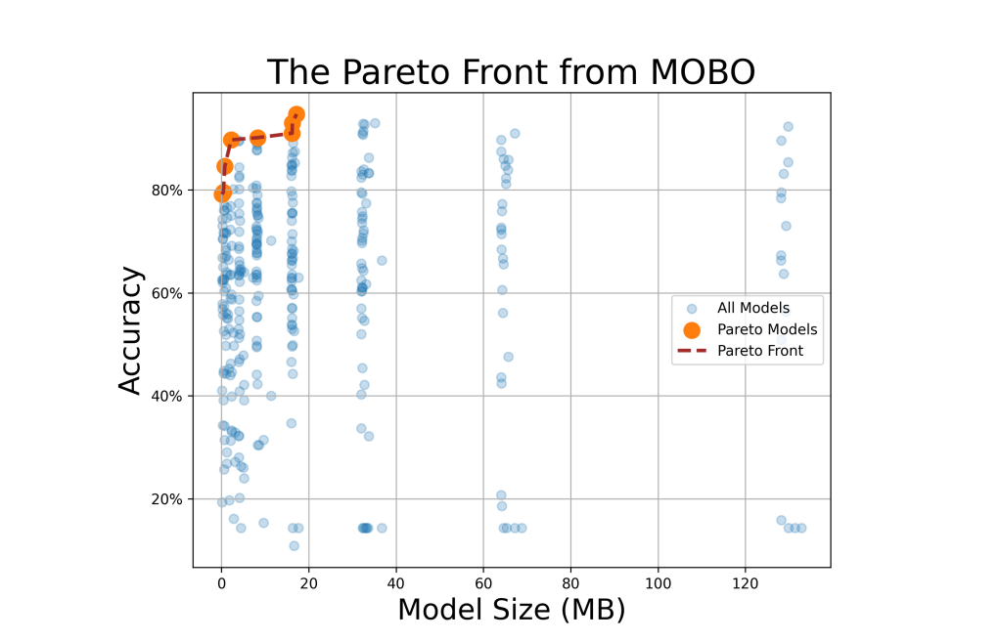

---

# Publications

1. Satarupa Das and Suman Samui, "Confidence-Aware Curriculum Learning-Based Knowledge Distillation for Efficient Computer Vision on TinyML Devices," Poster Presentation at IndoML 2025, BITS Pilani Hyderabad Campus, Hyderabad, India.

2. Satarupa Das, Soumen Garai, Soumya Chatterjee, Rajrup Saha, and Suman Samui, "Learning What to Trust: Confidence-Aware Curriculum Distillation for TinyML Vision," submitted to the International Conference on Signal Processing and Communications (SPCOM) 2026, Indian Institute of Science (IISc), Bengaluru, India.

3. Satarupa Das, Soumen Garai, and Suman Samui, "Hardware-Aware Joint Constrained Optimization and Knowledge Distillation for TinyML Computer Applications," submitted to Neurocomputing (Elsevier).

---

# Technologies Used

- Python
- TensorFlow
- Keras
- NumPy
- Scikit-learn
- Matplotlib
- TinyML

---

# Future Work

- Real TinyML hardware deployment
- Multi-teacher knowledge distillation
- Advanced uncertainty modeling
- Adaptive dynamic curriculum learning
- Cross-domain TinyML applications

---

# Citation

If you use this work, please cite:

```bibtex
@article{das2026clkd,
  title={Confidence-Aware Curriculum Knowledge Distillation for TinyML Vision},
  author={Das, Satarupa and Samui, Suman},
  year={2026}
}
```

---

# Contact

**Satarupa Das**  
M.Tech Researcher  
National Institute of Technology Durgapur
